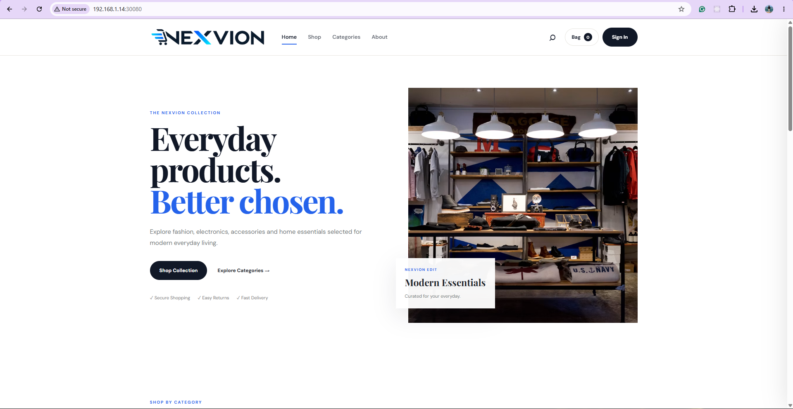
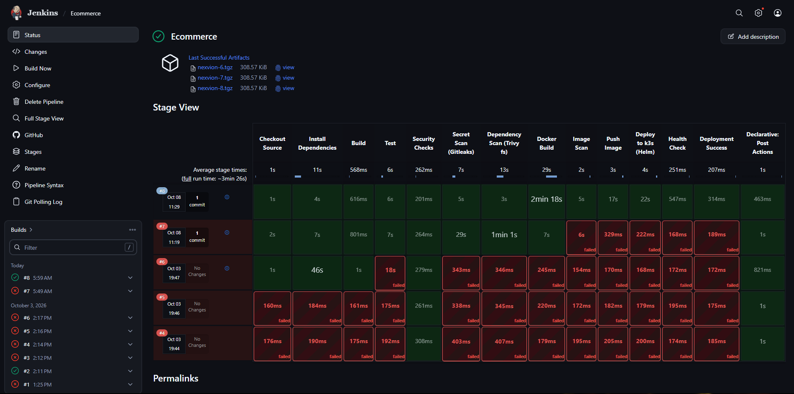
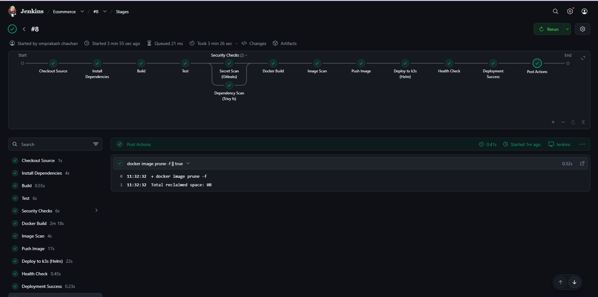
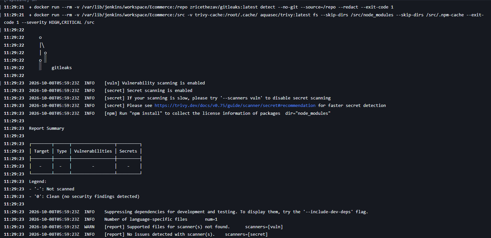
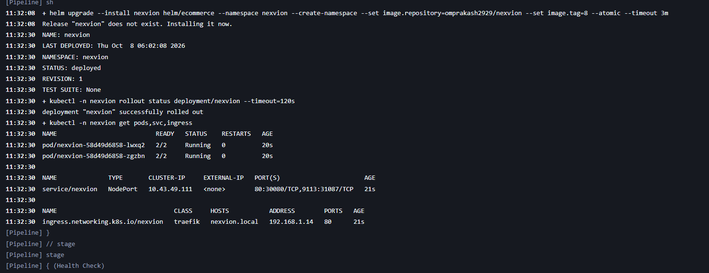
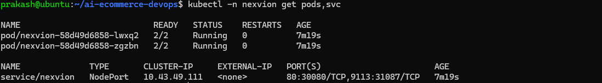
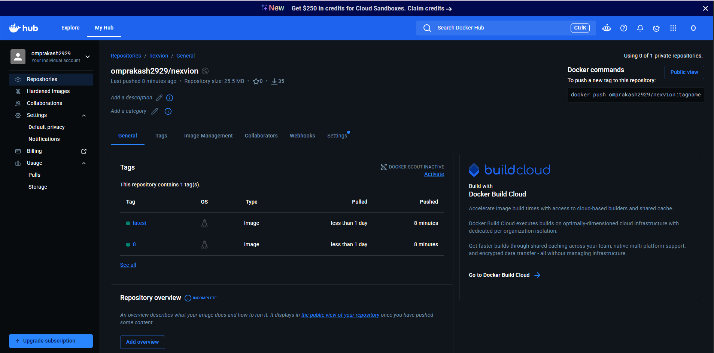
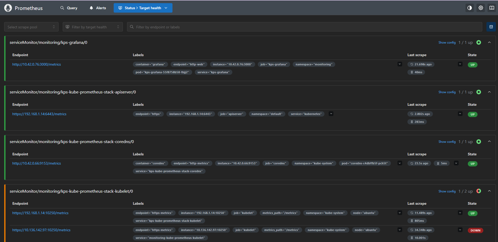
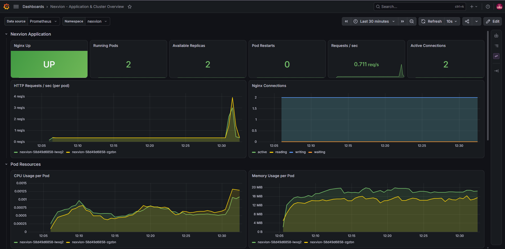
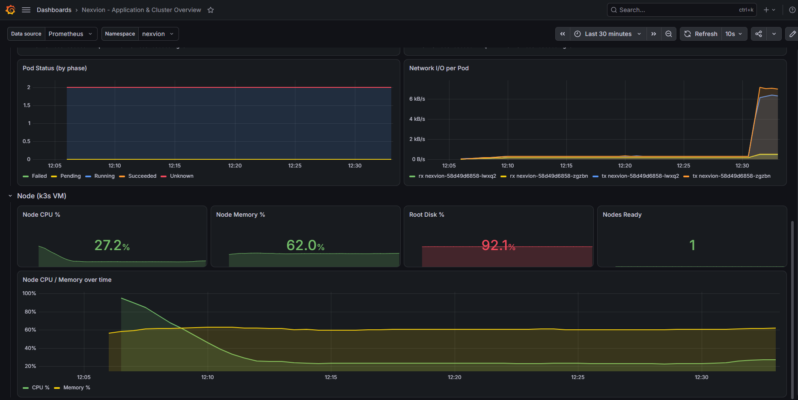

# AI-Powered E-Commerce DevOps and Cloud-Native Delivery Platform

A production-style DevOps platform built around **Nexvion**, an existing static e-commerce frontend. The goal of this project is not to build the application. The goal is to build a complete, automated, secure, observable and repeatable software delivery ecosystem around it.

Every change pushed to GitHub is linted, tested, scanned for secrets and vulnerabilities, packaged into a container, pushed to a registry and deployed to a Kubernetes (k3s) cluster using Helm. The deployment is then verified with health checks and monitored with Prometheus and Grafana.

> Built as part of the DevOps internship project at **Davine Technologies**.

## Table of Contents

1. [Project Status](#project-status)
2. [Architecture](#architecture)
3. [Technology Stack](#technology-stack)
4. [Repository Structure](#repository-structure)
5. [CI/CD Pipeline](#cicd-pipeline)
6. [DevSecOps](#devsecops)
7. [Containerization](#containerization)
8. [Kubernetes and Helm](#kubernetes-and-helm)
9. [Observability](#observability)
10. [Infrastructure as Code](#infrastructure-as-code)
11. [Getting Started](#getting-started)
12. [Access Points](#access-points)
13. [Troubleshooting Notes](#troubleshooting-notes)
14. [Roadmap](#roadmap)
15. [Author](#author)

## Project Status

| Area | Status |
|-|-|
| Git and GitHub workflow | Done |
| Containerization (Docker, Compose) | Done |
| CI/CD with Jenkins (13 stages) | Done |
| DevSecOps scanning (Gitleaks, Trivy) | Done |
| Kubernetes deployment on k3s with Helm | Done |
| Monitoring with Prometheus and Grafana | Done |
| Custom Grafana dashboard | Done |
| Configuration management with Ansible | Code ready |
| Infrastructure provisioning with Terraform (AWS) | Code ready |
| Centralized logging with ELK | Planned |
| AI-assisted incident analysis | Planned |
| Blue-Green and Canary demonstration | Planned |
| Cloud deployment on AWS | Planned |

## Architecture

### End-to-end delivery flow

```
Developer
    |
    v
GitHub (main branch)
    |
    v
Jenkins (poll SCM trigger)
    |
    +-> Checkout -> Install Dependencies -> Build -> Test
    |
    +-> Security Checks (Gitleaks and Trivy filesystem scan, in parallel)
    |
    +-> Docker Build -> Image Scan (Trivy) -> Push Image (Docker Hub)
    |
    +-> Deploy to k3s with Helm (atomic, automatic rollback)
    |
    +-> Health Check -> Deployment Success
    |
    v
Kubernetes (k3s)
    |
    +-> Nexvion pods (Nginx + Prometheus exporter sidecar)
    |
    +-> Service (NodePort) and Ingress (Traefik)
    |
    v
Prometheus -> Grafana dashboards
```

### Infrastructure layers

```
Terraform   : creates the cloud infrastructure (VPC, subnet, security group, EC2)
Ansible     : configures the server (Docker, Jenkins, k3s, Helm, hardening)
Kubernetes  : runs the application
Jenkins     : delivers the application
```

## Technology Stack

| Category | Technology | Role |
|-|-|-|
| Operating system | Ubuntu Server (VirtualBox VM) | Host for Jenkins, Docker and k3s |
| Version control | Git, GitHub | Source control, single source of truth |
| Web server | Nginx (unprivileged image) | Serves the Nexvion static site |
| Containerization | Docker, Docker Compose | Application packaging and local runs |
| CI/CD | Jenkins (Declarative Pipeline) | Build, test, scan, push and deploy |
| Registry | Docker Hub | Container image storage |
| Orchestration | k3s (lightweight Kubernetes) | Runs the application |
| Packaging | Helm | Versioned Kubernetes releases |
| Ingress | Traefik (bundled with k3s) | External access |
| Monitoring | Prometheus, Grafana (kube-prometheus-stack) | Metrics and dashboards |
| Metrics exporter | nginx-prometheus-exporter | Nginx request and connection metrics |
| Security | Gitleaks, Trivy | Secret, dependency and image scanning |
| IaC | Terraform | AWS infrastructure provisioning |
| Configuration | Ansible | Server configuration and hardening |
| Cloud | AWS | Target cloud environment |

## Repository Structure

```
ai-ecommerce-devops/
|- application/              Nexvion static frontend (HTML, CSS, JS)
|- docker/
|   |- Dockerfile            Nginx unprivileged, non-root, with healthcheck
|   |- nginx.conf            Health endpoint, security headers, metrics endpoint
|   |- docker-compose.yml    Local run
|   `- Dockerfile.dockerignore
|- jenkins/
|   |- Jenkinsfile           Main CI/CD pipeline (13 stages)
|   `- Jenkinsfile.infra     Terraform and Ansible validation pipeline
|- helm/
|   `- ecommerce/            Helm chart (deployment, service, ingress, servicemonitor)
|- monitoring/
|   |- prometheus/values.yaml    kube-prometheus-stack values for k3s
|   `- grafana/                  Custom dashboard JSON and loader script
|- ansible/
|   |- playbook.yml, inventory.ini, ansible.cfg
|   |- group_vars/
|   `- roles/                common, docker, jenkins, k3s, hardening
|- terraform/
|   |- main.tf, provider.tf, variables.tf, outputs.tf
|   |- modules/              network, compute
|   `- environments/dev/
|- scripts/
|   |- setup-k3s.sh          k3s, Helm and monitoring stack setup
|   `- smoke-test.sh         HTTP checks used by the pipeline
|- tests/validate.js         Static site tests
|- package.json              CI tooling (HTMLHint)
|- .gitleaks.toml            Secret scanning configuration
`- README.md
```

## CI/CD Pipeline

The pipeline is defined in `jenkins/Jenkinsfile` and follows the target architecture stage by stage. It is triggered automatically by Poll SCM every two minutes.

| # | Stage | What it does |
|-|-|-|
| 1 | Checkout Source | Pulls the latest code from GitHub |
| 2 | Install Dependencies | Installs CI tooling inside a Node container |
| 3 | Build | Assembles the site into `dist/` and archives a versioned artifact |
| 4 | Test | HTML linting, local asset reference checks, JavaScript syntax checks, Helm chart lint |
| 5 | Security Checks | Gitleaks (secrets) and Trivy filesystem scan run in parallel |
| 6 | Docker Build | Builds the image, tagged with the build number and latest |
| 7 | Image Scan | Trivy scans the image, fails on HIGH and CRITICAL findings |
| 8 | Push Image | Pushes the image to Docker Hub using Jenkins credentials |
| 9 | Deploy to k3s (Helm) | Atomic Helm upgrade with automatic rollback on failure |
| 10 | Health Check | Retries the smoke test against the live service |
| 11 | Deployment Success | Final confirmation |

Design decisions:

* **Tools run in containers.** Node, Gitleaks, Trivy and Helm lint run as throwaway Docker containers, so the Jenkins host stays clean and builds are reproducible.
* **Secrets never live in the repository.** The Docker Hub token is stored in Jenkins credentials and masked in logs.
* **Failures are loud.** Any HIGH or CRITICAL finding, failing test or failed rollout stops the pipeline.

A second pipeline, `jenkins/Jenkinsfile.infra`, validates the infrastructure code with Terraform format and validate checks, a Trivy configuration scan and an Ansible syntax check.

## DevSecOps

Security is part of the delivery pipeline, not a final step.

| Control | Tool or practice |
|-|-|
| Secret detection | Gitleaks on every build |
| Dependency and filesystem scan | Trivy filesystem scan |
| Container image scan | Trivy image scan, blocks HIGH and CRITICAL (unfixed issues ignored) |
| Non-root containers | `nginx-unprivileged` image running as a non-root user |
| Hardened web server | Security headers, server tokens disabled, only required endpoints exposed |
| Least privilege on AWS | Security group opens admin ports only to the administrator IP |
| Instance metadata | IMDSv2 required on EC2 |
| Encrypted storage | Encrypted gp3 root volume |
| Linux hardening | SSH hardening, fail2ban, sysctl settings, optional UFW (Ansible) |
| Credentials | Jenkins credential store, no secrets in Git |
| Infrastructure scanning | Trivy configuration scan on Terraform code |

## Containerization

The Nexvion image is built on `nginxinc/nginx-unprivileged`:

* Runs as a non-root user and listens on port 8080
* Custom `nginx.conf` with a `/healthz` endpoint used by Docker and Kubernetes probes
* Gzip, static asset caching and security headers
* An internal `stub_status` endpoint on port 8081, read only by the exporter sidecar
* Docker `HEALTHCHECK` built in

Build and run locally from the repository root:

```bash
docker build -f docker/Dockerfile -t nexvion:1.0 .
docker run -d -p 8080:8080 nexvion:1.0
curl http://localhost:8080/healthz
```

## Kubernetes and Helm

The application is packaged as the Helm chart in `helm/ecommerce` and runs in the `nexvion` namespace.

* Deployment with 2 replicas and a rolling update strategy (`maxUnavailable: 0`)
* Readiness and liveness probes on `/healthz`
* CPU and memory requests and limits
* Two containers per pod: Nginx and the Prometheus exporter sidecar
* NodePort service on port 30080 and a Traefik Ingress for `nexvion.local`
* ServiceMonitor created automatically when the Prometheus Operator is present
* Deployed with an atomic Helm upgrade, so a failed release rolls back automatically

## Observability

Monitoring is provided by the kube-prometheus-stack Helm chart, tuned for a single-node k3s cluster.

A custom Grafana dashboard (`monitoring/grafana/nexvion-dashboard.json`) is loaded through a labelled ConfigMap and covers three areas:

| Section | Panels |
|-|-|
| Application | Nginx up or down, running pods, available replicas, pod restarts, requests per second, active connections |
| Pod resources | CPU and memory per pod, pod status by phase, network I/O |
| Node | Node CPU, memory and disk usage, nodes ready, CPU and memory over time |

Load the dashboard from the repository root:

```bash
bash monitoring/grafana/load-dashboard.sh
```

## Infrastructure as Code

### Terraform (AWS)

Located in `terraform/`, organized into reusable modules:

* `modules/network`: VPC, public subnet, internet gateway, route table
* `modules/compute`: Ubuntu 24.04 EC2 instance, key pair, security group with rules scoped per purpose, IMDSv2, encrypted volume
* `environments/dev`: environment specific values

```bash
cd terraform
terraform init
terraform plan -var-file=environments/dev/terraform.tfvars
terraform apply -var-file=environments/dev/terraform.tfvars
```

Set `admin_cidr` in `terraform.tfvars` to your own public IP. The validation rule rejects `0.0.0.0/0`. Remember to run `terraform destroy` after demos to avoid unnecessary cost.

### Ansible

Located in `ansible/`, using idempotent roles:

| Role | Responsibility |
|-|-|
| common | Base packages and project directories |
| docker | Docker installation and group membership |
| jenkins | Java, Jenkins, port configuration, Docker access |
| k3s | k3s, Helm, kubeconfig for the user and for Jenkins |
| hardening | SSH policy, fail2ban, sysctl, optional UFW |

```bash
cd ansible
ansible-galaxy collection install -r requirements.yml
ansible-playbook playbook.yml -K
```

Terraform creates the server, then Ansible configures it. The Terraform output prints a ready to use inventory line for the `[aws]` group.

## Getting Started

### Prerequisites

* Ubuntu Server VM (4 vCPU, 8 GB RAM, 40 GB disk recommended)
* Docker and Docker Compose
* A Docker Hub account and an access token
* A GitHub account

### 1. Clone the repository

```bash
git clone https://github.com/omprakash2929/ai-ecommerce-devops.git
cd ai-ecommerce-devops
```

### 2. Set up k3s, Helm, Prometheus and Grafana

```bash
bash scripts/setup-k3s.sh
```

### 3. Install and configure Jenkins

Install Jenkins on the VM (manually or with the Ansible `jenkins` role), then:

1. Install the Pipeline, Git and Credentials Binding plugins.
2. Add a credential of type Username with password, ID `dockerhub-creds`, using your Docker Hub username and an access token.
3. Create a Pipeline job using "Pipeline script from SCM", this repository, branch `main` and script path `jenkins/Jenkinsfile`.
4. Edit `DOCKERHUB_USER` at the top of the Jenkinsfile.

### 4. Run the pipeline

Click Build Now once. After that, every push to `main` starts the pipeline automatically.

### 5. Load the Grafana dashboard

```bash
bash monitoring/grafana/load-dashboard.sh
```

## Access Points

Replace `92.168.1.14` with the IP address of the VM.

| Service | URL |
|-|-|
| Nexvion application | `http://92.168.1.14:30080` |
| Nexvion through Ingress | `http://nexvion.local` (add the host entry first) |
| Jenkins | `http://92.168.1.14/:8080` |
| Grafana | `http://92.168.1.14:32000` |
| Prometheus | `http://92.168.1.14:32090` |

Get the Grafana admin password:

```bash
kubectl get secret -n monitoring kps-grafana -o jsonpath='{.data.admin-password}' | base64 -d
```

## Troubleshooting Notes

Real issues met while building this project and how they were solved:

| Problem | Cause | Fix |
|-|-|-|
| `$WORKSPACE includes invalid characters` in Docker | The variable was stored in the Jenkins `environment` block, so the shell never expanded it | Define the command inside the `sh` block |
| `checkout scm is only available in Multibranch or Pipeline script from SCM` | Jenkinsfile pasted directly into the job | Switch the job to Pipeline script from SCM |
| `helm lint` could not find `Chart.yaml` | Wrong file names and templates folder in the wrong place | Use `Chart.yaml` and keep templates inside `helm/ecommerce/templates` |
| Docker build `/application not found` | Build ran inside the `docker/` folder | Run the build from the repository root with `-f docker/Dockerfile` |
| Trivy first run is slow | Vulnerability database download | Cached in a Docker volume after the first run |
| Grafana dashboards missing | Monitoring stack was not installed yet | Run `scripts/setup-k3s.sh` |
| Root disk almost full | Docker images and build cache | `docker image prune`, `docker builder prune`, journal vacuum |

## Roadmap

* Centralized logging with Elasticsearch, Kibana and Filebeat
* AI-assisted incident analysis: read error logs, classify them, estimate severity, suggest probable root cause and remediation
* Blue-Green and Canary deployment demonstration
* Full deployment on AWS using the Terraform and Ansible code in this repository
* Remaining operational scripts (backup, cleanup, log management)
* Architecture diagrams and a recorded demo

## Screenshots

Add screenshots to `screenshots` and they will render here.

 
 
 
 
 
 
 
 
 
 


  

## Author

**Omprakash Chauhan**, DevOps Intern at Davine Technologies.

* GitHub: [omprakash2929](https://github.com/omprakash2929)
* Portfolio: [omprakashchauhan.tech](https://omprakashchauhan.tech)